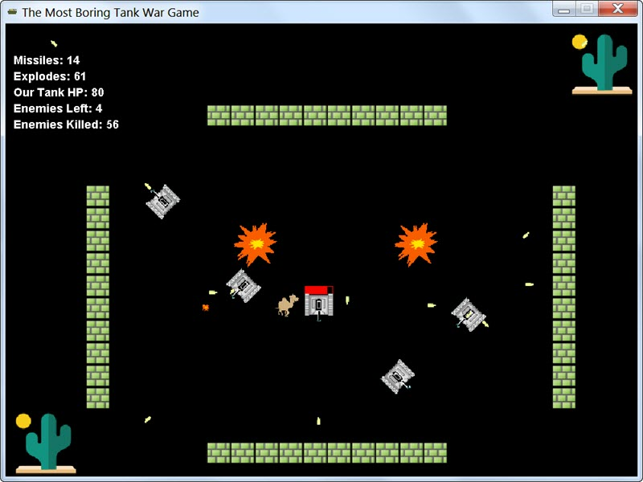
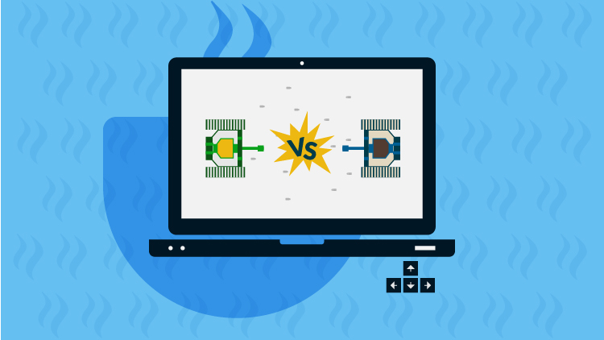
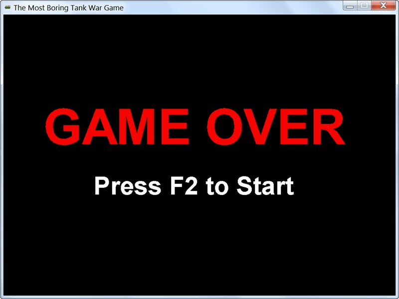

## Mid-Term Project: Tank War



You are required to implement a simple Tank War game using OOP concepts in Java programming
language. Sounds exciting, right?

PS: I've published a course at [Udemy](https://www.udemy.com/java-tank-war/?couponCode=JAVA-NEVER-SLEEP), you may use
coupon code `CSDNDEMO` to get the course for free if they are still available, or use coupon
code `JAVA-NEVER-SLEEP` to get the course for **$9.99** only.

[](https://www.udemy.com/java-tank-war/?couponCode=JAVA-NEVER-SLEEP)

It's taught in Chinese with step by step implementation instruction, which is very helpful for
Java beginners. You may check the [curriculum](Outline.md) for more details.

### Development Environment
It's recommended to use IDEA community edition as IDE. Using JDK8 to compile your code. You may
fork this repository to your own and start your own solution. Since `Tools.java` uses javafx media
to play audio file, if you are using JDK11 you need to add those jar files manually.

### Player Tank & Keyboard Control
* There should be one and only one tank controlled by player using keyboard. You can use Up, Down,
Left, Right to move the tank in eight directions, which means, you should include LeftUp, UpRight,
RightDown, DownLeft also. Image files of the tank in eight directions will be provided under directory
`assets/images/tank${direction}.gif`
* When you press CTRL, your tank would fire a missile. Images of missile in eight directions are also
provided as `assets/images/missile${direction}.gif`, direction of the missile should
be same as that of Tank. Sound effect can be simulated using audio file `assets/audios/shoot.wav`
* When you press A, you tank would trigger a SUPER-FIRE: fire to 8 directions at the same time!
Sound effect can be simulated using either `assets/audios/supershoot.aiff` or `assets/audios/supershoot.wav` randomly
* Player tank has a initial maximum HP of 100. Please draw a blood bar with tank in the upper
to display player tank's health status

### Enemy Tanks
* There will be 12 enemy tanks in the beginning, the images are same with player tank,
but without blood bar
* Enemy tanks will move and fire randomly. Fire sound effect same as player tank. Enemy
tank will not trigger SUPER-FIRE forever, or it will be too difficult for you to survive
* If enemy tank was hit by a missile fired from player tank, it dies immediately and would
disappear from the screen
* If enemy tank fire a missile and hit player tank, it will reduce 20HP from player tank
* If all enemy tanks were dead, reproduce 12 enemy tanks again so that game can continue

### Explosion
* If a missile from player tank hit any enemy tank, or a missile from any enemy tank hit
player tank, please simulate a explosion
* There are 10 images file for you to simulate a simple animation effect under directory
`assets/images`, from `0.gif` to `10.gif`
* Explosion sound effect audio file `assets/audios/explode.wav`

### Wall
* Simulate 4 walls, one in upper-middle, two in left and right, one in bottom-middle
* Use `assets/images/brick.png` to build the walls
* Tank cannot penetrate wall, as it should be
* If missile hit wall, it simply disappears

### Blood
* In the beginning of the game there will be a blood jumping in the center. If player tank
eats the blood its HP will be restored to 100 immediately! Play audio file `assets/audios/revive.wav`
when this happens
* If blood was eaten it will disappear
* If player tank HP was lower than 50%, blood will appear again so that player tank can be
healed completely, however, blood will appear with a chance of 66.7%

### Optional(It's up to you)
* Place two tress in the upper-right and bottom-left using `assets/images/tree.png`
* Fighting against enemies forever can be lonely and boring, a small camel pet might make you
a little bit happier: `assets/images/pet-camel.gif`
* You can search some cute audio files for your pet at here if you want: https://freesound.org/

### Game Rule
* Press SPACE to start game, before that all game objects should stay still
* Tank will move with speed of 5, which means its x and y will either plus or minus 5
* Missile will fly with speed of 10, which means its x and y will either plus of minus 10
* When player tank and enemy tank move and meet, they cannot penetrate each other as it should be
* If HP of player tank was lower or equal to 0, GAME OVER! You should end the game, play the
`assets/audios/death.mp3` audio file as an indicator and print message in the screen like this:
>     GAME OVER
>     PRESS F2 TO RESTART

You may refer to this screenshot as an example:


* After user press F2 game will restart with initial settings
* Display these data in the left-upper side, for example:
```
Missiles: 50
Explodes: 10
Our Tank HP: 80
Enemies Left: 8
Enemies Killed: 452
```

### Implementation Tips
* Design classes of `Tank`, `Missile`, `Wall`, `Blood`, and `Explosion`
* You can simply using `#fillRect` to draw walls with gray color, just calculate their locations
* To detect object collision, you can using `Rectange#intersects`, you can define a method `getRectangle`
for game objects for simple collision detection
* Write a enum `Direction` with 8 directions there(provided in skeleton code)
* Write a game client `TankWar`, with 800 * 600 screen, title and icon(image file provided `assets/images/icon.png`)
* Using a infinite loop to repaint the screen with interval of 50MS
* Change location of tank, missile, explode and implement draw method within these classes
* Develop step by step, write a little and test it soon, use Version Control to manage your
development stage and for easy roll back also
* For your convenience, `Tools.java` and a initial `TankWar.java` as game client was provided.
Basic methods like generate random number, play audio file and etc are there already. The general
idea to draw game objects are also included. However, you still need many work to achieve the goal
we set, feel free to modify the code, as they are just a very rough start and even would have issues
or bad smells. Take care!
* Read javadoc or browse the source code when you get stuck, ask help when you get stuck more than
one hour, as this mid-term project is somewhat challenging for beginners

### Honor Code & Advice
* Make sure you are doing the work independently. Just Be Honest. It's acceptable that you cannot
figure out how to finish this project, but it's TOTALLY UNACCEPTABLE that you did not do what you
should do and what you can do
* It's never allowed to copy&paste code either from web or other students' solution directly.
If you are inspired please add them to your reference list
* To make sure you fully understand what you are doing, in the presentation class, you will be
asked to implement some minor adjustment feature within 10-20 minutes, or at least you should
know where to change it. Those who failed to do this will be possibly treated as cheating
* You will gain most benefit when you struggles with implementation, to improve your coding skills,
you need to set up a challenging goal, and achieve it by all means.
* Keep coding, keep coding, and keep coding

### When You Get Depressed
* This project would be challenging and difficult for many beginners, it will consume you tons of time,
it will hurt your feelings, make you feel uncomfortable, be depressed and so on. Negative emotions
will accumulate so that you would hate your instructor or even curse him - though he doesn't care
* You may ask for counselling service from Church Pastor or an old, wise man
* But still, you need to calm down and keep going, after many sleepless nights, after you conquered this
little stupid game, you will be proud of what you have achieved and congratulations! You are in a higher
level now, and there are many challenging problems waiting for you to resolve, and make a difference

### Happy Coding!


## License

See the [LICENSE](LICENSE.md) file for license rights and limitations (MIT).
